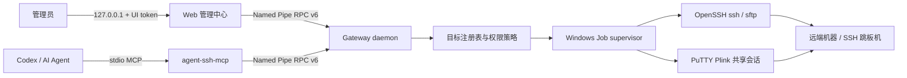

# Agent SSH Gateway

Agent SSH Gateway 是一个运行在 Windows 本机、面向 Codex 和其他 AI Agent 的策略化 SSH 控制平面。管理员通过仅监听回环地址的 Web 管理中心维护 SSH 私钥、目标机器、连接方式和权限；Agent 通过 stdio MCP 查询机器状态、执行受控命令、跟踪长任务以及传输文件。

项目不自行实现 SSH 协议。普通目标由 Windows OpenSSH 的 `ssh.exe` / `sftp.exe` 负责连接、host key 校验和 `ProxyJump`；企业 AccessClient 目标由 PuTTY Plink 复用管理员已经登录的共享会话。Gateway 负责目标映射、授权、超时与取消、进程树清理、输出保留和审计。

当前版本为 `0.1.0`，包为私有、未授权发布状态。Gateway 运行端目前仅支持 Windows，远端可为 Windows、Linux 或 macOS。

## 能力概览

- **两种连接方式**：OpenSSH 私钥连接，或 AccessClient/PuTTY 已登录共享会话。
- **集中管理**：本机 Web 管理中心维护全局私钥库和最多 1,024 个目标；MCP 不暴露配置修改或私钥读取接口。
- **三档权限**：精确单行命令白名单、`full-access` 和 `deny`，另有独立的目标启用开关。
- **结构化执行**：Full access 目标支持固定 shell、工作目录、环境变量和多行脚本，不把脚本正文放进本机 `ssh.exe` 参数。
- **可恢复长任务**：构建等任务由 daemon 持有，可跨 MCP 客户端断连继续运行，并支持增量日志、状态查询、取消和超时。
- **受控文件传输**：OpenSSH 目标支持上传、下载和本机到远端的单向目录同步，包含 `dryRun`、断点续传、SHA-256 校验和配额控制。
- **部署前观测**：固定只读探针可读取机器身份、系统、磁盘、Docker/Compose 状态，并检查 Compose 配置、端口归属、容器健康和可用空间。
- **Windows 进程清理**：实际 SSH 命令和文件传输使用的 `ssh.exe`、`sftp.exe`、`plink.exe` 都通过 .NET Job Object supervisor 启动，取消、超时和父进程退出时清理本机进程树。
- **受保护的输出与审计**：大输出以不透明引用分页读取；审计记录请求摘要和结果，不记录原始命令、脚本、输出、token 或路径。

它适合让仅持有 MCP 能力的 Agent 操作一组预先授权的机器。它不提供交互式 shell/PTY、密码或 MFA 代填、端口转发、多租户授权，也不是同一 Windows 账户内的强隔离沙箱。

## 架构



常规部署包含以下边界：

- `agent-ssh-service`：产品入口，启动本机管理中心并管理 Gateway daemon。
- `agent-ssh-mcp`：由 Codex 按配置启动的 stdio MCP 适配器，不监听 HTTP 端口。
- Gateway daemon：持有配置 generation、任务、输出、审计和 Named Pipe RPC。
- OpenSSH / Plink：根据目标连接模式选择的受管子进程。

所有配置修改都在管理中心完成。保存配置时，服务会生成并校验新的不可变 revision；没有活动操作时，daemon 在原 Named Pipe 和 runtime token 上热加载新 generation，当前 MCP 进程无需重启。

## 环境要求

- Windows 10/11 或 Windows Server
- Node.js 24 或更高版本
- .NET 9 SDK，用于构建 x64 Windows Job Object supervisor
- Windows OpenSSH Client（`ssh.exe`、`sftp.exe` 和托管模式使用的 `ssh-keygen.exe`）

OpenSSH 目标还需要：

- 远端账户已启用公钥认证
- 经过独立可信渠道核验的 `known_hosts`

AccessClient 目标还需要：

- 与 AccessClient/PuTTY 共享连接兼容的 `plink.exe`
- 管理员能够在本机 AccessClient 中打开并登录目标

不要直接把未经独立指纹核验的 `ssh-keyscan` 输出作为信任依据。

## 快速开始

在仓库根目录执行：

```powershell
npm ci
npm run build
npm run start:service
```

`build` 会先构建 .NET supervisor，再编译 TypeScript 并复制管理中心静态资源。源码更新后必须重新构建；`start:service` 运行的是 `dist` 中的产物。

服务启动后会输出类似：

```text
Agent SSH management center: http://127.0.0.1:PORT/#token=...
Gateway runtime: C:\Users\YOUR_NAME\AppData\Local\agent-ssh-gateway\managed\runtime
Press Ctrl+C to stop.
```

打开完整的管理 URL。页面读取 fragment token 后会立即从地址栏清除它，并只在当前标签页的 `sessionStorage` 中保留会话。关闭标签页或重启服务后，可使用 MCP 工具 `ssh_open_admin`，或重新打开服务输出的新 URL。

默认托管目录是：

```text
%LOCALAPPDATA%\agent-ssh-gateway\managed
```

也可以指定目录和端口：

```powershell
npm run start:service -- --managed-directory C:\AgentSsh\managed --port 8765
```

`--port 0` 是默认值，表示使用随机空闲端口。管理中心始终只监听 `127.0.0.1`。托管目录必须位于本地固定磁盘，不能是磁盘根、UNC/映射网络盘、device path、ADS 或包含 reparse point 的路径。

## 配置 OpenSSH 目标

### 1. 准备全局私钥

在“全局设置 -> 私钥管理”中：

- 生成无口令的 Ed25519 私钥，或在兼容场景下生成 RSA 3072 私钥。
- 或从本机绝对路径导入现有私钥。导入路径只是一次性输入，服务校验后将密钥复制到受保护的全局密钥库，不在机器配置或 MCP 状态中回显源路径。
- 将页面展示的公钥加入目标账户的 `authorized_keys`。管理中心会根据目标平台生成可复制的首次安装命令。

每把密钥都有稳定的 `keyId`、名称、算法、指纹和公钥，可供多个目标或跳板机复用。仍被当前配置或保留 revision 引用的密钥不能删除。

### 2. 准备 host key

通过独立可信渠道核验目标及可选跳板机的 SSH host key，并写入本机 `known_hosts`。非 22 端口使用 OpenSSH 的 `[host]:port` 形式。

未知或不匹配的 host key 会直接导致连接失败；Gateway 不会自动接受或更新。

### 3. 新增机器

在“SSH 管理中心”新增目标并填写：

- 公共别名、可选说明和远端平台
- 地址、端口、用户名和全局密钥
- 已核验的 `known_hosts` 路径
- 可选的结构化 SSH 跳板机及其全局密钥
- 权限模式、最大超时和可选文件传输范围

用户名既可为普通账户，也可为严格的 `portalUser/targetIPv4/systemUser` 企业堡垒机透传格式。透传入口应直接配置为目标，不要同时启用 `ProxyJump`；此时 host key 代表入口 SSH 服务，不代表其后端资产。

保存后点击“检测连接”。该操作只调用 Gateway 固定的 `hostname` 探针，不接受管理员或 Agent 提供的命令文本。

## 配置 AccessClient 目标

AccessClient 模式复用本机已经登录的 PuTTY 共享连接，不读取 AccessClient 密码、OTP、URI、票据、窗口内容或进程命令行，也不会关闭管理员现有的 PuTTY 窗口。

1. 在“全局设置 -> PuTTY 共享连接”保存兼容的 `plink.exe` 绝对路径。
2. 新增机器，连接方式选择“AccessClient 已登录会话”。
3. 填写目标地址、SSH 端口、AccessClient 账号、平台和命令权限，然后保存机器。管理中心会用这组地址、端口和账号建立唯一的共享连接身份。
4. 点击“检测连接”。如果共享会话尚不可用，页面会自动进入两分钟的准备状态。
5. 保持管理页面打开，并按页面提示从 AccessClient 打开该目标。首次连接时，PuTTY 仍可能要求管理员核对并手动确认 host key。
6. 页面检测到新 PuTTY 后会自动请求固定 `hostname` 探针；验证成功即完成，不需要再次点击“检测连接”。

首次验证成功时，服务会自动保存目标 hostname；后续连接必须匹配该值，否则以机器身份不一致失败，且不会自动重新进入准备流程。发现新的 PuTTY 进程本身不代表目标可信，只有固定探针通过才算验证完成。

同一时间只能准备一台 AccessClient 目标，准备期间配置变更会被拒绝。临时 PuTTY `LogHost` 设置会在验证成功、超时、取消、失败或服务关闭时恢复；中断恢复状态保存在受保护的本机 runtime 中。

每个目标最多维持一条受管 Plink 下游会话。同一目标的命令按 FIFO 执行，不同目标可并行；会话空闲 60 秒回收，绝对寿命为 10 分钟。AccessClient 模式当前只提供命令通道，上传、下载和目录同步始终关闭。

## 权限模型

下表描述 Web 管理中心保存的 v3 托管目标：

| 模式 | 单行命令 | 结构化脚本 | OpenSSH 文件传输 | AccessClient 文件传输 |
| --- | --- | --- | --- | --- |
| `allow-list` | 仅精确匹配 | 不允许 | 按独立传输策略 | 不允许 |
| `full-access` | 任意合法命令 | 允许 | 合法绝对路径双向 | 不允许 |
| `deny` | 不允许 | 不允许 | 不允许 | 不允许 |

`allow-list` 按完整 UTF-8 单行字符串精确匹配，不支持正则、通配符或参数模板。远端 shell 仍会解释其中的重定向、替换和运算符，所以每条白名单都应按可执行代码审查。

`full-access` 不是沙箱。它允许远端账户范围内的任意代码执行；OpenSSH 目标还可访问 Gateway 运行账户可读取的合法本机绝对路径。每次保存 Full access 配置都需要重新确认风险。

`ssh_check_connection` 和 `ssh_target_info` 是只读例外：它们使用 Gateway 固定探针，可在 `allow-list`、`full-access` 或 `deny` 模式下诊断启用的目标。`ssh_docker_preflight` 仍只对 `full-access` 开放。禁用目标会拒绝探针、命令和文件传输。

结构化执行仅对 `full-access` 目标开放。

低层手写 `gateway.yaml` 的命令策略与文件传输策略彼此独立：即使命令策略为 `deny`，管理员仍可显式授权文件传输。该高级模式应分别审查 `policy` 和 `transfer`；它不受上表中托管 UI 联动规则约束。

## 接入 Codex

在用户级 `C:\Users\YOUR_NAME\.codex\config.toml` 中配置：

```toml
[mcp_servers.agent_ssh]
command = 'C:\absolute\path\to\node.exe'
args = [
  'E:\202608\enhanced_ssh\dist\src\mcp\main.js',
  '--data-directory',
  'C:\Users\YOUR_NAME\AppData\Local\agent-ssh-gateway\managed\runtime',
]
```

`--data-directory` 必须指向 `agent-ssh-service` 输出的 **Gateway runtime**，不是仓库目录或 managed 根目录。

这里的 `agent_ssh` 只是 Codex 中的 MCP 服务名；管理中心内的 `managed-ssh`、`dev-linux` 等才是工具参数 `target` 使用的目标。每个目标有不可变 `targetId`、当前别名和保存的历史别名，这些引用都会解析到同一条权限策略。

daemon 与 MCP 当前使用内部协议 v6，并严格校验版本。Gateway 尚未启动或尚未配置时，MCP 仍可初始化；启动服务或保存配置后，下一次工具调用会重新读取 runtime 并自动恢复连接。

可以直接对 Codex 说：

```text
检查 SSH Gateway 状态
打开 SSH 管理中心
列出当前可用的 SSH 目标
检查 dev-linux 是否能连接
读取 build-windows 的系统、磁盘和 Docker 状态
在 dev-linux 上执行 hostname
在 build-windows 的 D:\services\app 中启动构建，并持续跟踪日志
```

## MCP 工具

| 工具 | 用途 |
| --- | --- |
| `ssh_gateway_status` | 查看管理服务、Gateway 和目标摘要 |
| `ssh_open_admin` | 在默认浏览器打开管理中心，不向 Agent 返回管理员 token |
| `ssh_ping` | 检查底层 Gateway daemon |
| `ssh_list_targets` | 列出目标 ID、别名、平台、启用状态和有效权限 |
| `ssh_check_connection` | 使用固定 `hostname` 探针检测目标 |
| `ssh_exec` | 同步执行单行命令或 Full access 结构化脚本 |
| `ssh_start` | 启动 daemon 持有的长任务并返回 `runId` |
| `ssh_status` | 查询任务状态、时长、输出计数和最终结果 |
| `ssh_tail` | 使用不透明 cursor 增量读取任务 UTF-8 日志 |
| `ssh_cancel` | 按 `runId` 取消执行或传输任务 |
| `ssh_upload` | 启动一个受控 SFTP 上传任务 |
| `ssh_download` | 启动一个受控 SFTP 下载任务 |
| `ssh_sync` | 本机到远端的非删除式单向目录同步 |
| `ssh_target_info` | 固定只读探针：机器 ID、host key、OS、磁盘及 Docker/Compose |
| `ssh_docker_preflight` | 固定只读 Docker 部署预检 |
| `ssh_read_output` | 以 Base64 分页读取同步执行的保留输出 |
| `ssh_read_output_text` | 以 UTF-8 文本和不透明 cursor 读取保留输出 |

### 执行命令

精确白名单和 Full access 都支持兼容的单行形式：

```json
{
  "target": "dev-linux",
  "command": "hostname",
  "timeoutMs": 10000
}
```

Full access 目标还支持结构化执行。Windows 可选 `powershell` 或 `cmd`，Linux/macOS 使用 `bash`：

```json
{
  "target": "build-windows",
  "shell": "powershell",
  "cwd": "D:\\services\\app",
  "env": {
    "COMPOSE_PROJECT_NAME": "app"
  },
  "script": "docker compose config\ndocker compose build",
  "encoding": "utf-8",
  "timeoutMs": 1800000
}
```

`shell` 不能指定任意可执行文件，`encoding` 当前固定为 `utf-8`。脚本、工作目录和环境变量通过受管 stdin 传给固定远端入口，但仍属于远端可执行输入，不要在其中放置密码、私钥或长期 token。

### 跟踪长任务

构建、安装和其他耗时工作应使用 `ssh_start`：

```text
ssh_start({...}) -> { "runId": "...", "state": "running" }
ssh_tail({ "runId": "..." }) -> 新增 stdout/stderr + nextCursor
ssh_tail({ "runId": "...", "cursor": "nextCursor" }) -> 后续日志
ssh_status({ "runId": "..." }) -> running | succeeded | failed | timed_out | cancelled
ssh_cancel({ "runId": "..." }) -> 取消仍在运行的任务
```

任务在发起它的 MCP 连接断开后仍会继续，新的 MCP 连接可凭同一 `runId` 查询或取消。任务只保留到配置的 TTL，且不跨 daemon 重启持久化。不要在启动响应不确定时自动重试，避免重复产生远端副作用。

### 传输文件

受限目标必须使用管理员配置的本机根目录别名和其下相对路径；远端路径必须位于授权根目录内。下面是 `ssh_upload` 示例：

```json
{
  "target": "dev-linux",
  "localRoot": "release-artifacts",
  "localPath": "build/app.zip",
  "remotePath": "/srv/releases/app.zip",
  "overwrite": false,
  "resume": true,
  "dryRun": true,
  "verify": "sha256"
}
```

OpenSSH Full access 目标可省略 `localRoot`，直接使用 Gateway 本机和远端的合法绝对路径。建议先以 `dryRun: true` 检查，再明确改为 `false`；`overwrite: true` 具有破坏性。

`ssh_upload`、`ssh_download` 和 `ssh_sync` 都返回 `runId`，通过相同的 `ssh_status`、`ssh_tail` 和 `ssh_cancel` 跟踪。同步只从本机复制到远端，不删除远端多余文件。所有模式仍会执行路径规范化、文件类型检查、配额、校验和、受控发布、超时、取消与审计。

### 机器与 Docker 预检

`ssh_target_info` 使用固定只读探针确认目标身份和运行环境。返回的稳定机器 ID 仅在当前 Gateway 密钥范围内稳定；OpenSSH 目标的 SSH host-key 指纹来自受信任配置，不能代替首次人工核验。AccessClient 目标无法从共享命令通道独立取得后端资产的 SSH host key，因此会返回空指纹和 warning；自动绑定的 hostname 也不能替代管理员对 AccessClient 资产和入口的信任核验。

`ssh_docker_preflight` 可在部署前检查 Docker daemon/context、Compose 配置、端口占用归属、当前项目容器及健康状态和磁盘空间：

```json
{
  "target": "build-windows",
  "intent": "update",
  "project": {
    "directory": "D:/services/app",
    "composeFiles": ["compose.yaml"],
    "name": "app"
  },
  "ports": [
    { "protocol": "tcp", "port": 18080 }
  ],
  "requiredFreeBytes": 10737418240
}
```

`intent` 可为 `create`、`update` 或 `inspect`。预检只读，不会构建、启动、停止或删除容器，结果汇总为 `ready`、`degraded` 或 `blocked`。

## 配置与恢复

托管配置当前为 fleet profile v3：

- 每个目标拥有稳定 `targetId`；改名后旧别名作为兼容映射保留。
- 目标与跳板机只保存全局 `keyId`，不保存导入源路径或外部 `identityFile`。
- 发布前会校验私钥结构、目标和跳板机 host key、生成配置的 `ssh.exe -G` 最终值及 Gateway schema。
- 凭据与 `known_hosts` 被复制进 ACL 仅允许当前用户和 `SYSTEM` 的不可变 revision。
- 系统保留当前 revision 和一个 rollback revision；候选加载失败会继续运行原配置。
- 可识别的 v2 fleet 和旧单目标配置会从已有托管凭据迁移到 v3；迁移失败不会提交半完成状态。
- 有命令、任务或连接检测正在运行时，配置保存返回 `CONFIG_BUSY`，待操作结束或取消后重试。

托管目录中的 runtime token、私钥、配置、输出和审计都属于敏感数据，不应放入源码树、网络共享或多个用户可写的目录。

## 安全边界

使用前请阅读 [SECURITY.md](SECURITY.md)。最重要的边界是：

- 管理中心只监听 IPv4 loopback，并使用独立的短期 UI token；不要分享完整管理 URL。
- MCP 只暴露执行和观测工具，不提供机器、权限或私钥的修改接口。
- OpenSSH 强制批处理、公钥认证、严格 host key 校验，并关闭密码回退、agent/X11/端口转发和交互 PTY。
- `full-access` 不是沙箱。生产环境应使用专用低权限 Windows 账户和远端账户，并用 ACL、容器或虚拟机限制影响范围。
- stdout/stderr 可能包含秘密；不要把敏感结果转发到不受信任的模型、日志或页面。
- timeout/cancel 会终止 Gateway 本机的受管进程树，但不能保证终止远端已经脱离 SSH 会话的后台任务。

## 低层 daemon 与 CLI

通常应使用管理中心。需要手写 Gateway 配置或复用复杂现有 OpenSSH 配置时，可直接运行底层入口：

```powershell
node dist\src\daemon\main.js --config C:\absolute\path\to\gateway.yaml

$env:AGENT_SSH_GATEWAY_DATA_DIR = 'C:\ProgramData\agent-ssh-gateway'
node dist\src\cli\main.js ping
node dist\src\cli\main.js targets
node dist\src\cli\main.js run dev-linux --command 'uname -a' --timeout-ms 10000
node dist\src\cli\main.js output OUTPUT_REF stdout --offset 0 --limit 65536
```

低层配置示例见 [config/gateway.example.yaml](config/gateway.example.yaml)。它是 daemon 的严格 `version: 1` YAML 配置，不是 Web 管理中心保存的 v3 fleet profile；其中引用的路径、OpenSSH 配置和目标必须由管理员自行准备和保护。

CLI 目前只提供 `ping`、`targets`、`run` 和 `output`。完整任务、传输和观测能力以 MCP 与管理中心为主。

## 开发与验证

```powershell
npm run typecheck
npm test
npm audit --omit=dev
```

`npm test` 会先完整构建，再用 Node.js test runner 串行运行 `dist/test/**/*.test.js`。测试覆盖配置、IPC、热加载、进程树、OpenSSH/Plink 路由、管理中心、MCP 恢复、任务、输出、审计和文件传输。

仅测试管理页面和协议交互、不连接真实 SSH 时：

```powershell
npm run start:test-ui -- --demo
```

产品入口始终是 `npm run start:service`；`test-ui --demo` 只用于开发。

## 目录结构

```text
src/
  service/    产品服务入口与管理控制面描述符
  daemon/     Gateway 生命周期、IPC、配置 generation 与存储安全
  mcp/        stdio MCP 服务和 17 个工具
  core/       目标授权、执行、任务、输出、探针与文件传输
  infra/      OpenSSH、Plink、SFTP、进程树、host key 与审计
  config/     严格 YAML 配置加载
  shared/     RPC v6 协议、路径、错误和客户端
  test-ui/    Web 管理中心及托管 v3 配置
native/
  windows-job-supervisor/   .NET 9 Job Object supervisor
config/
  gateway.example.yaml      低层 daemon 配置示例
test/
  unit/                     单元测试
  integration/              集成测试
```
